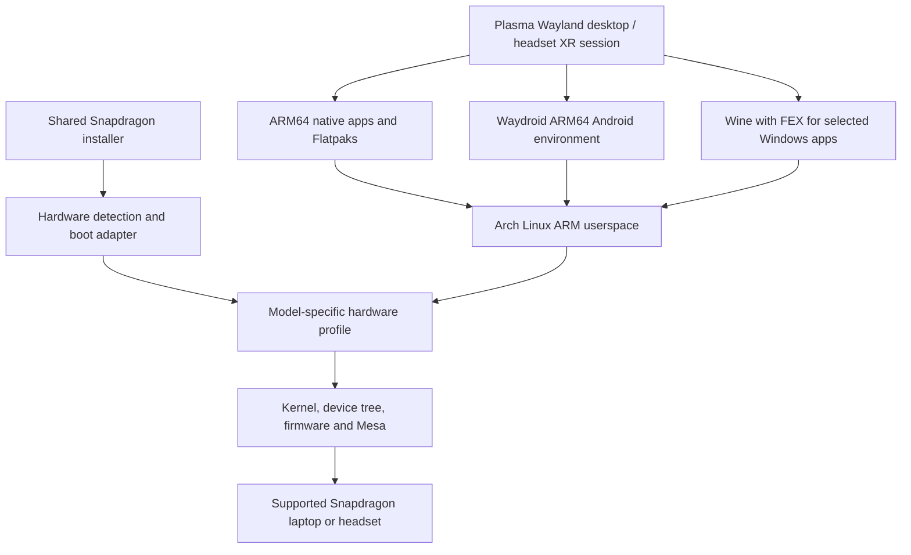

# Proposed architecture

Status: proposed implementation choices unless marked as observed or confirmed in [Decisions](DECISIONS.md).

## Base system

Use Arch Linux ARM AArch64 userspace and a small MainFrameOS package repository for maintained changes. Arch Linux ARM is a separate project from the main Arch Linux distribution. Audit package coverage and update cadence before committing to a release schedule.

Build against one consistent repository snapshot. Avoid combining SteamOS and Arch repositories or copying random packages from the existing installation. Recover useful local modifications as source-controlled packages with clear dependencies.

## Kernel and graphics

Prefer upstream Linux support. Carry only required patches, each with its origin, target kernel, reason, test coverage and upstream/removal status. Initially evaluate the existing working kernel as a hardware baseline; do not assume its version string provides reproducible source provenance.

Keep each device's kernel, device tree, modules, initramfs and required firmware compatible. Use Mesa Freedreno/Turnip where the GPU is supported. Verify the exact GPU and feature requirements against current driver support, not only an Adreno family label.

## Shared installer

One installer orchestrates platform detection, compatibility checks, storage choice, shared system deployment and recovery setup. Laptop and headset boot adapters handle different entry and installation paths. See [Installer design](INSTALLER.md); this architecture is a target, not an implemented installer.

## Hardware profiles

A profile owns model matching, boot requirements, firmware manifest, kernel/device-tree selection, audio UCM configuration, power settings, service dependencies and known limitations. Shared Snapdragon components belong in common packages; board-specific quirks remain scoped to that board.

An unrecognized board must not silently receive another laptop's hardware profile. Provide a clear unsupported-device result and an explicit developer path for investigation.

## Desktop and integration

Use Plasma Wayland and normal desktop defaults. Prioritize display scaling, multiple monitors, virtual desktops, touchpad behavior, accessibility, clipboard, file associations and screen/audio capture.

Use Discover with Flatpak support as the initial application interface candidate. Integrate Android and Windows launchers into the existing desktop before considering a custom app manager. Separate application installation from complete operating-system updates so that the interface clearly identifies what is being updated.

## Runtime boundaries

Android uses its own container image and lifecycle. Windows apps use separate Wine prefixes and recorded runtime versions. Development containers can provide additional tools without making the base OS a mixture of distributions.

Wine prefixes are configuration separation, not security sandboxes. Define explicit filesystem/device access and use appropriate containment when executing untrusted applications. Desktop file exchange should be intentional and understandable.

## Production image

Prototype with a writable developer installation. Design the public edition around a managed base image, persistent user data and a known-good fallback. Select the deployment mechanism after boot paths and recovery behavior have been tested across the supported platform adapters. See [Updates and recovery](UPDATES-AND-RECOVERY.md).
